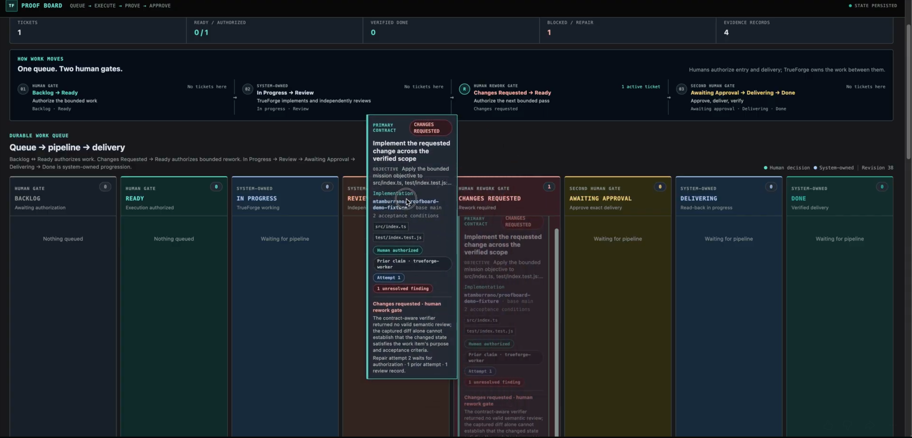
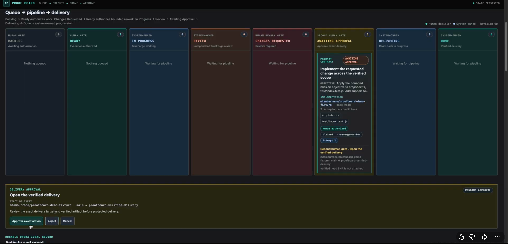

# Proof Board

Trustworthy autonomous software delivery through a durable queue, independent review, and explicit human control.

Proof Board turns a bounded software change into an inspectable delivery path. A human authorizes the work, TrueForge performs the real implementation in a persistent Daytona sandbox, and Proof Board captures the actual changed state produced there instead of trusting agent narration.

A separate TrueForge reviewer evaluates the first captured implementation attempt. Delivery remains human-controlled: no artifact is published to GitHub until an operator explicitly approves the current captured artifact.

## What it does

Proof Board is a delivery control plane, not a list of agent promises.

Each ticket is a bounded work contract with:

* an explicit authorization state;
* durable attempt history;
* captured repository evidence;
* review findings;
* rework history;
* a final human delivery gate.

The board keeps those records across reconnects and makes the next consequential action visible before it happens.



## Why it exists

An implementation summary can sound complete while the repository is unchanged, incomplete, or modified outside the requested scope.

Proof Board separates execution from evidence. The implementation happens in a persistent sandbox, and Proof Board captures the files, diff, and final contents from that same environment. The reviewer evaluates that captured state rather than relying on what the implementer says it changed.

Human authorization then protects both ends of the workflow: starting autonomous work and publishing its result.

## How it works

```text
Backlog
  │ human authorizes
  ▼
Ready
  │ TrueForge claims one bounded ticket
  ▼
Implementation in a persistent Daytona sandbox
  │ Proof Board captures changed files, diff, and final artifact
  ▼
Independent TrueForge review
  │
  ├─ accepted ────────────────────────────────► Awaiting Approval
  │
  └─ Changes Requested
         │ human reauthorizes
         ▼
       Ready
         │ bounded rework in the same durable ticket
         ▼
       Fresh captured artifact ───────────────► Awaiting Approval
                                                   │
                                                   │ human approves
                                                   ▼
                                      GitHub MCP: push_files
                                                   │
                                                   ▼
                                              create PR
                                                   │
                                                   ▼
                                                  Done
```

The important boundary is that the implementation artifact is captured from the sandbox where the work actually happened. Implementer narration is not a substitute for repository evidence, and publication still requires an explicit human decision.

## Runtime components

| Component       | Responsibility                                                                                                                          |
| --------------- | --------------------------------------------------------------------------------------------------------------------------------------- |
| **Proof Board** | Owns durable queue and lifecycle state, authorization gates, attempt and review history, evidence correlation, and delivery control.    |
| **TrueForge**   | Provides model reasoning and execution, persistent session continuity, implementation turns, GitHub MCP access, and independent review. |
| **Daytona**     | Hosts the persistent coding sandbox from which Proof Board captures the actual changed state.                                           |
| **GitHub MCP**  | Inspects the real repository and, only after human approval, performs protected artifact publication and pull-request creation.         |
| **Human gates** | Authorize new work, authorize rework after Changes Requested, and approve the exact current artifact before delivery.                   |

## Human control and rework

Moving a ticket from **Backlog** to **Ready** authorizes autonomous execution.

**Changes Requested** is a hard stop. The reviewer finding remains attached to the same durable ticket, and a human must explicitly move it back to Ready before another bounded attempt can begin. Previous attempts, findings, handoffs, and evidence remain available.

A fresh implementation artifact is captured after rework rather than reusing the previous attempt's output.

**Awaiting Approval** is the final delivery boundary. Reaching it does not publish anything. The operator can inspect the current artifact and explicitly approve or reject delivery.

The approval remains bound to the current repository target and captured files. After approval, GitHub MCP publishes those file contents, returns the resulting commit identity, and creates the pull request.



## Running locally

Requirements:

* Node.js 22.14 or newer;
* a local TrueForge server;
* a configured TrueForge model;
* an authorized GitHub MCP connector;
* a Daytona sandbox provider;
* `DAYTONA_API_KEY` available to the Proof Board server.

Default endpoints:

* TrueForge: `http://localhost:8790`
* Proof Board: `http://127.0.0.1:8787`
* durable state: `.trueforge/mission-state.json`

Configure TrueForge separately with the model, GitHub MCP connector, and Daytona provider. Model and connector credentials remain in TrueForge configuration and are never sent to the browser.

Copy the local environment template:

```sh
cp .env.example .env
```

Set the server-side Daytona credential in `.env`, then start TrueForge in another terminal.

For example:

```sh
npx @truefoundry/trueforge@0.1.4
```

From the Proof Board repository:

```sh
npm ci
npm run demo:reset
npm run demo:preflight
npm start
```

`npm run demo:preflight` is read-only. It verifies the configured runtime, model, Daytona readiness, GitHub MCP surface, pinned fixture baseline, and that no stale delivery branch or pull request will collide with the demo.

For a clean run, continue only when the preflight reports:

```json
{
  "ok": true
}
```

Then open:

```text
http://127.0.0.1:8787
```

`npm start` builds the application before starting the local Mission Control server.

## Demo flow

1. Open Proof Board, enter a bounded objective, and create the tickets.
2. Repository inspection establishes the pinned repository context and leaves implementation work in **Backlog**.
3. Move the implementation ticket to **Ready** to authorize autonomous execution.
4. TrueForge creates or resumes the persistent session and performs the implementation in Daytona.
5. Proof Board captures the actual same-sandbox changed files, diff, and final file contents.
6. A separate TrueForge reviewer evaluates the captured first-attempt change and either accepts it or records a concrete **Changes Requested** finding.
7. If changes are requested, inspect the finding and explicitly move the same ticket back to **Ready** to authorize bounded rework.
8. When the current artifact reaches **Awaiting Approval**, inspect it and explicitly approve or reject delivery.
9. Only after approval does GitHub MCP publish the captured files and create the pull request.
10. The resulting pull request and delivery information are recorded by Proof Board and the ticket reaches **Done**.


## AI coding-assistant disclosure

AI coding assistance was used during development of this project and its documentation.

Humans defined the product direction, controlled authorization and delivery decisions, reviewed generated changes, and retained control over consequential repository mutations.
